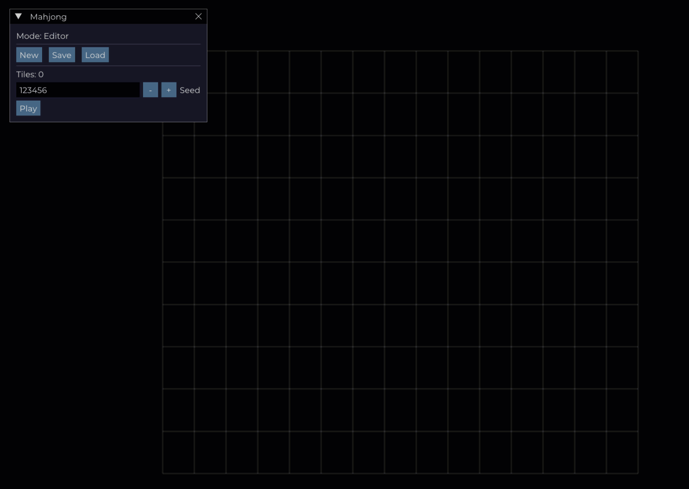

# Mahjong Layout Editor Prototype



## 📜 Project Description

This project is a **Mahjong tile layout editor prototype** built with the **Defold** game engine.
It allows you to create, edit, and save Mahjong tile layouts in an interactive graphical interface.

The prototype includes both an **editor mode** and a basic **game mode** for placing and removing tiles on the board.
You can use this tool to design custom layouts and export them for use in other games or applications.

---

## ✨ Features

* **Mahjong tile layout editor** with a clear visual interface.
* **Multiple tile layers** (supports 3D-style layouts with stacked tiles).
* **Ghost tile preview** showing where the next tile will be placed before clicking.
* **Placement validation**:

  * Tiles on layer `z=0` can only be placed within the base grid.
  * Tiles above layer `z=0` can only be placed if there’s another tile underneath (no floating tiles).
* **Safe tile deletion** with error prevention when deleting already removed nodes.
* **Saving layouts** to a file.
* **Loading saved layouts** from a file.
* **Coordinate conversion** between screen space and grid coordinates.
* **Boundary checking** to prevent placement outside the field.
* **Layer-aware placement and removal**.

---

## 🖼 Interface Overview

* The working field is an **8×15 grid** (big cells).
* Each tile can be placed on a layer `z = 0 ... Z_MAX`.
* When hovering over a valid position, a **semi-transparent ghost tile** (tile `debug`) appears to indicate the placement position.

---

## 🎮 Controls

| Action                          | Description                                                      |
| ------------------------------- | ---------------------------------------------------------------- |
| **Left Click** on empty cell    | Place a tile on the current layer (if valid).                    |
| **Left Click** on occupied cell | Move to the next layer above that tile and try to place another. |
| **Right Click** on tile         | Remove the tile directly under the cursor.                       |
| **Mouse movement**              | Updates ghost tile position.                                     |
| Cursor leaves the board         | Ghost tile is hidden.                                            |

---

## ⚙️ Installation & Run

1. Clone the repository:

   ```bash
   git clone https://github.com/username/mahjong-layout-editor.git
   cd mahjong-layout-editor
   ```

2. Open the project in [Defold](https://defold.com/).

3. Run the project (`Ctrl + B` or **Build** button in Defold Editor).

---

## 🧩 Core Logic

### 1. Coordinate Conversion

* Converts mouse screen coordinates into **big cell grid coordinates**.
* Each layer uses its own projected offset.

### 2. Placement Validation

* For `z=0` — checks if the cell is within the base 8×15 grid.
* For `z>0` — requires a tile directly below on `z-1`.

### 3. Ghost Tile

* Appears only when the placement position is valid.
* Disappears when the cursor leaves the valid area or if no supporting tile exists.

### 4. Safe Deletion

* After deleting a GUI node, its variable is explicitly set to `nil` to avoid errors from double deletion.

---

## 💾 Save Format

Layouts are stored in JSON format:
```json
[
  { "bx": 3, "by": 5, "z": 0, "face": "bamboo_5" },
  { "bx": 4, "by": 5, "z": 0, "face": "bamboo_6" },
  { "bx": 3, "by": 5, "z": 1, "face": "bamboo_7" }
]
```

* `bx`, `by` — grid coordinates (big cell).
* `z` — layer.
* `face` — tile type/texture.

---

## 🛠 For Developers

* The code includes **comments for all key functions**.
* Can be integrated into any Defold-based game.

---

## 📜 License

This project is released under the **MIT License**.
You are free to use, modify, and distribute it, provided that attribution is retained.

---